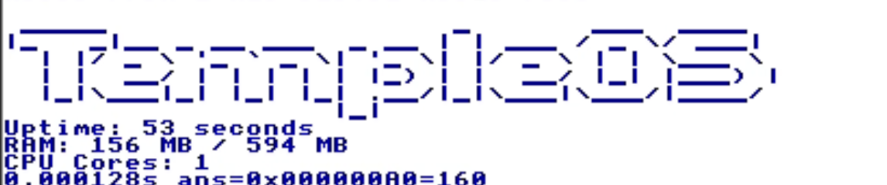

# TempleFetch
This is a neofetch like fetch utility for TempleOS.

https://github.com/user-attachments/assets/cc06554b-bbbf-4728-814b-ceb912524571

This was built entirely in HolyC which is the programming language used in TempleOS and this was my first time using HolyC so the code is probably not very good. I also had a hard time to figure out how to get a qemu virtual disk to work with TempleOS so I had to do a lot of experimentation with OS configuration to get it right.

Displayed Info:
- OS Name
- Uptime
- CPU Info
- RAM Info

## Running on your own machine

1. Install QEMU (for virtualization). If you don't wanna use a VM, you're on your own :)
2. Clone this repository.
3. Use the `./build-project-iso.sh` script to prepare the TempleOS ISO. This will create a `ProjectCD.iso` file in the root of the repository.
4. Run `qemu-img create -f raw templeos-hdd.img 512M)`
5. Run the `./tos-install.sh` (Make sure to select Yes when it asks if you wanna install it).
6. Run `./tos-dev.sh` to start the VM.
7. Once inside, you can run the program by `#include "T:/Main.HC"`

### AI Usage Declaration
I had tab completions on and I used claudecode to debug the issues I had to get the qemu virtual disk to work with TempleOS. AI wasn't much helpful in the code itself tho.
